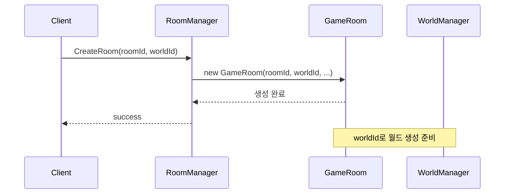
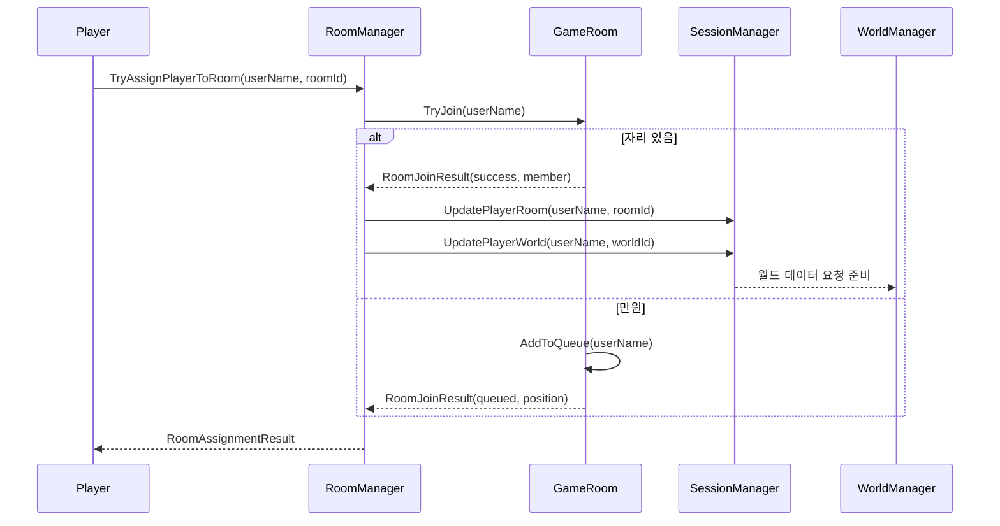

# 룸 기반 멀티플레이어 아키텍처

**작성일**: 2025-11-08
**버전**: 1.0
**상태**: Production

---

## 목차

1. [개요](#1-개요)
2. [아키텍처 검증 결과](#2-아키텍처-검증-결과)
3. [룸 시스템 구조](#3-룸-시스템-구조)
4. [월드 관리 시스템](#4-월드-관리-시스템)
5. [데이터 흐름](#5-데이터-흐름)
6. [클라이언트-서버 통신](#6-클라이언트-서버-통신)
7. [확장성 및 제한사항](#7-확장성-및-제한사항)
8. [향후 개선 사항](#8-향후-개선-사항)

---

## 1. 개요

### 1.1 목적

HELLO_MY_WORLD 프로젝트는 **룸 기반 멀티플레이어 아키텍처**를 채택하여, 여러 플레이어가 독립적인 게임 월드(룸)에서 함께 플레이할 수 있도록 설계되었습니다.

### 1.2 핵심 개념

```
로비(Lobby) → 방(Room/GameRoom) → 월드(World) → 청크(Chunks)
    ↓              ↓                    ↓              ↓
  대기실        플레이어 그룹        지형 데이터      16x256x16 블록
```

### 1.3 주요 특징

- ✅ **룸 기반 월드 격리**: 각 룸은 독립적인 worldId를 가짐
- ✅ **동적 플레이어 관리**: 큐잉, 관전 모드, 역할 시스템
- ✅ **결정적 월드 생성**: 동일 시드 = 동일 지형
- ✅ **청크 기반 스트리밍**: 플레이어 주변만 로드
- ✅ **실시간 동기화**: 블록 변경, 플레이어 움직임

---

## 2. 아키텍처 검증 결과

### 2.1 검증 항목

| 검증 항목 | 상태 | 비고 |
|-----------|------|------|
| **룸 생성/삭제 시스템** | ✅ 구현됨 | `GameRoom.cs`, `RoomManager.cs` |
| **WorldId 기반 월드 격리** | ✅ 구현됨 | 각 GameRoom에 worldId 할당 |
| **동일 월드 공유** | ✅ 구현됨 | 같은 룸 = 같은 worldId = 같은 월드 |
| **플레이어 룸 할당** | ✅ 구현됨 | `RoomManager.TryAssignPlayerToRoom()` |
| **청크 생성/로드** | ✅ 구현됨 | `WorldManager.GetChunkAsync()` |
| **블록 동기화** | ✅ 구현됨 | `WorldManager.UpdateBlockAsync()` |
| **클라이언트 핸들러** | ✅ 구현됨 | `RoomEnterHandler`, `RoomLeaveHandler`, `RoomListHandler` |

### 2.2 검증 결론

**✅ 룸 기반 아키텍처가 완전히 구현되어 있으며, 모든 클라이언트와 서버 코드가 이 아키텍처 위에서 동작합니다.**

---

## 3. 룸 시스템 구조

### 3.1 핵심 클래스

#### GameRoom (`GameServer/Room/GameRoom.cs`)

```csharp
public class GameRoom
{
    public string RoomId { get; }           // 고유 룸 ID
    public int WorldId { get; }             // 연결된 월드 ID ⭐
    public string DisplayName { get; }      // 표시 이름
    public int MaxPlayers { get; }          // 최대 플레이어 수
    public string LobbyId { get; }          // 소속 로비 ID
    public string GameMode { get; }         // 게임 모드 (survival, creative 등)
    public RoomVisibility Visibility { get; } // Public, Private, Friends
    public RoomStatus Status { get; }       // Waiting, Playing, Finished

    // 플레이어 관리
    private Dictionary<string, RoomMember> _members;  // 활성 멤버
    private List<RoomMember> _queue;                  // 대기열
}
```

**핵심**: 각 GameRoom은 **고유한 WorldId**를 가지며, 이를 통해 WorldManager와 연결됩니다.

#### RoomManager (`GameServer/Room/RoomManager.cs`)

```csharp
public class RoomManager
{
    private Dictionary<string, GameRoom> _rooms;          // 모든 룸
    private Dictionary<string, string> _playerRoom;        // 플레이어 → 룸 매핑

    // 룸 생성
    public bool CreateRoom(
        string roomId,
        int worldId,           // ⭐ 월드 ID
        string displayName,
        int maxPlayers,
        string gameMode
    );

    // 플레이어 할당
    public RoomAssignmentResult TryAssignPlayerToRoom(
        string userName,
        string roomId
    );

    // 룸 방송
    public async Task BroadcastToRoomAsync<T>(
        string roomId,
        MessageType type,
        T message
    );
}
```

### 3.2 룸 생성 플로우



### 3.3 플레이어 참가 플로우



### 3.4 역할 시스템

```csharp
public enum RoomRole
{
    Queue = 0,       // 대기열 (월드 접근 불가)
    Player = 1,      // 일반 플레이어
    Host = 2,        // 방장 (설정 변경 권한)
    Spectator = 3    // 관전자 (읽기 전용)
}
```

### 3.5 큐잉 시스템

룸이 만원일 때 플레이어는 큐에 대기:

```csharp
// 큐 승격
public RoomMember? PromoteNextFromQueue()
{
    if (_queue.Count == 0) return null;

    var next = _queue[0];
    _queue.RemoveAt(0);
    next.Role = RoomRole.Player;
    _members[next.UserName] = next;

    return next;
}
```

플레이어가 나가면 큐의 첫 번째 플레이어가 자동으로 승격됩니다.

---

## 4. 월드 관리 시스템

### 4.1 WorldManager 구조

```csharp
public class WorldManager
{
    private readonly int _worldId;                              // ⭐ 룸의 WorldId
    private readonly WorldSeedConfig _worldSeed;                // 월드 시드 (결정적 생성)
    private readonly TerrainGenerationPipeline _terrainPipeline;
    private readonly ConcurrentDictionary<string, LoadedChunk> _loadedChunks;

    public WorldManager(DatabaseHelper database, int worldId, WorldSeedConfig? worldSeed = null)
    {
        _worldId = worldId;  // 룸에서 전달된 worldId 저장
        _worldSeed = worldSeed ?? LoadWorldSeedFromDatabase() ?? WorldSeedConfig.Random();
        // ...
    }
}
```

### 4.2 룸 ↔ 월드 연결

```
GameRoom(roomId: "room1", worldId: 1)
    └── WorldManager(worldId: 1)
            ├── WorldSeed(seed: 12345)
            ├── LoadedChunks: { (0,0), (0,1), (1,0), ... }
            └── Database: world_1_chunks table

GameRoom(roomId: "room2", worldId: 2)
    └── WorldManager(worldId: 2)
            ├── WorldSeed(seed: 67890)  // 다른 시드 = 다른 지형
            ├── LoadedChunks: { (0,0), (0,1), ... }
            └── Database: world_2_chunks table
```

### 4.3 청크 생성 및 로드

```csharp
public async Task<ChunkData?> GetChunkAsync(int chunkX, int chunkZ)
{
    var chunkKey = GetChunkKey(chunkX, chunkZ);

    // 1. 메모리 캐시 확인
    if (_loadedChunks.TryGetValue(chunkKey, out var loadedChunk))
    {
        loadedChunk.LastAccessed = DateTime.UtcNow;
        return loadedChunk.Data;
    }

    // 2. 데이터베이스 로드
    var chunkData = await LoadChunkFromDatabase(chunkX, chunkZ);

    // 3. 없으면 생성
    if (chunkData == null)
    {
        chunkData = await GenerateChunk(chunkX, chunkZ);  // ⭐ 결정적 생성
        await SaveChunkToDatabase(chunkX, chunkZ, chunkData);
    }

    // 4. 캐시에 저장
    _loadedChunks[chunkKey] = new LoadedChunk { Data = chunkData };

    return chunkData;
}
```

### 4.4 블록 변경 동기화

```csharp
public async Task UpdateBlockAsync(
    int chunkX, int chunkZ,
    int blockX, int blockY, int blockZ,
    BlockType blockType,
    int playerId)
{
    // 1. 청크 로드
    var loadedChunk = _loadedChunks[GetChunkKey(chunkX, chunkZ)];

    // 2. 블록 업데이트
    loadedChunk.Data.SetBlock(localX, blockY, localZ, blockType);
    loadedChunk.IsModified = true;

    // 3. 데이터베이스 저장 (worldId 포함!)
    await _database.SaveBlockChangeAsync(
        _worldId,          // ⭐ 어떤 월드의 블록인지
        chunkX, chunkZ,
        blockX, blockY, blockZ,
        (int)blockType,
        playerId
    );
}
```

---

## 5. 데이터 흐름

### 5.1 룸 참가 → 월드 로드

```
[클라이언트]
    ↓
1. RoomEnterRequest { roomId: "room1" }
    ↓
[RoomEnterHandler]
    ↓
2. RoomManager.TryAssignPlayerToRoom(userName, "room1")
    ↓
[GameRoom]
    ↓
3. GameRoom.TryJoin(userName)
    → RoomMember 생성
    ↓
[SessionManager]
    ↓
4. UpdatePlayerWorld(userName, worldId: 1)
    → 플레이어 세션에 worldId 저장
    ↓
[클라이언트]
    ↓
5. RoomEnterResponse { success: true, worldId: 1, roomInfo: {...} }
    ↓
6. ChunkDataRequest { chunkX: 0, chunkZ: 0 }
    ↓
[WorldManager(worldId: 1)]
    ↓
7. GetChunkAsync(0, 0)
    → 청크 생성/로드
    ↓
8. ChunkDataResponse { compressedBlockData: [...] }
    ↓
[클라이언트]
    ↓
9. Unity에서 청크 렌더링
```

### 5.2 블록 변경 동기화

```
[플레이어 A] (room1, worldId: 1)
    ↓
1. WorldBlockChangeRequest { blockPos: (10, 64, 20), blockType: Stone }
    ↓
[WorldManager(worldId: 1)]
    ↓
2. UpdateBlockAsync(...)
    → 블록 변경
    → DB 저장
    ↓
[RoomManager]
    ↓
3. BroadcastToRoomAsync("room1", WorldBlockChangeBroadcast)
    ↓
[모든 room1 플레이어들]
    ↓
4. WorldBlockChangeBroadcast 수신
    → Unity에서 블록 업데이트
```

---

## 6. 클라이언트-서버 통신

### 6.1 메시지 타입

#### 룸 관련 메시지

```protobuf
// proto/enhanced_minecraft_game.proto

message RoomEnterRequest {
  string room_id = 1;
  string password = 2;  // 선택사항
}

message RoomEnterResponse {
  bool success = 1;
  string message = 2;
  RoomInfo room = 3;
  int32 world_id = 4;     // ⭐ 중요
}

message RoomListResponse {
  repeated RoomInfo rooms = 1;
}

message RoomInfo {
  string room_id = 1;
  string display_name = 2;
  int32 world_id = 3;     // ⭐ 중요
  int32 player_count = 4;
  int32 capacity = 5;
  string game_mode = 6;
}
```

#### 월드 관련 메시지

```protobuf
// proto/game_world.proto

message ChunkDataRequest {
  int32 chunk_x = 1;
  int32 chunk_z = 2;
  int32 view_distance = 3;
}

message ChunkDataResponse {
  int32 chunk_x = 1;
  int32 chunk_z = 2;
  bool success = 3;
  bytes compressed_block_data = 4;
}

message WorldBlockChangeRequest {
  string area_id = 1;
  string subworld_id = 2;
  Vector3Int block_position = 3;
  int32 block_type = 4;
}

message WorldBlockChangeBroadcast {
  Vector3Int block_position = 3;
  int32 block_type = 4;
  string player_id = 6;
  int64 timestamp = 7;
}
```

### 6.2 핸들러 구조

```csharp
// GameServer/Handlers/RoomEnterHandler.cs
public class RoomEnterHandler : MessageHandler<RoomEnterRequest>
{
    private readonly RoomManager _roomManager;

    public override async Task HandleAsync(Session session, RoomEnterRequest message)
    {
        var result = _roomManager.TryAssignPlayerToRoom(
            session.UserName,
            message.RoomId
        );

        if (result.Success)
        {
            var response = new RoomEnterResponse
            {
                Success = true,
                Room = result.Room.ToRoomInfo(),  // worldId 포함!
                WorldId = result.Room.WorldId     // ⭐
            };

            await session.SendAsync(MessageType.RoomEnterResponse, response);
        }
    }
}
```

---

## 7. 확장성 및 제한사항

### 7.1 현재 확장성

| 항목 | 용량 | 비고 |
|------|------|------|
| **동시 룸 수** | 제한 없음 | 메모리/CPU에 따라 제한 |
| **룸당 플레이어** | 설정 가능 | MaxPlayers (기본값: 무제한) |
| **월드 크기** | 무제한 | 청크 기반 동적 생성 |
| **청크 캐싱** | 1000개 | `ChunkCacheSize` 설정 가능 |
| **동시 접속자** | ~100-200 | 단일 서버 기준 (로드 밸런싱 미구현) |

### 7.2 제한사항

#### 7.2.1 단일 서버 아키텍처

현재는 모든 룸이 **하나의 GameServer 프로세스**에서 실행됩니다.

```
GameServer (단일 프로세스)
├── Room1 (worldId: 1) - 10 players
├── Room2 (worldId: 2) - 5 players
├── Room3 (worldId: 3) - 20 players
└── Room4 (worldId: 4) - 8 players
```

**한계**:
- CPU/메모리 병목
- 단일 장애점 (서버 다운 시 모든 룸 중단)

#### 7.2.2 월드 간 이동 불가

플레이어는 한 번에 하나의 룸(월드)에만 있을 수 있습니다.

#### 7.2.3 룸 삭제 시 월드 소실

룸이 삭제되면 해당 worldId의 데이터는 DB에 남지만, 자동 정리되지 않습니다.

### 7.3 데이터베이스 구조

```sql
-- 블록 변경 기록 (worldId별 격리)
CREATE TABLE block_changes (
    id INTEGER PRIMARY KEY,
    world_id INTEGER NOT NULL,    -- ⭐ 룸의 worldId
    chunk_x INTEGER NOT NULL,
    chunk_z INTEGER NOT NULL,
    block_x INTEGER NOT NULL,
    block_y INTEGER NOT NULL,
    block_z INTEGER NOT NULL,
    block_type INTEGER NOT NULL,
    player_id INTEGER NOT NULL,
    timestamp INTEGER NOT NULL
);

-- 청크 데이터 (worldId별 저장)
CREATE TABLE chunks (
    world_id INTEGER NOT NULL,
    chunk_x INTEGER NOT NULL,
    chunk_z INTEGER NOT NULL,
    data BLOB NOT NULL,
    PRIMARY KEY (world_id, chunk_x, chunk_z)
);
```

---

## 8. 향후 개선 사항

### 8.1 우선순위 P1 (중요)

#### 1. 룸 → WorldManager 자동 연결

**현재**: WorldManager를 수동으로 생성하고 룸과 연결해야 함

**개선**:
```csharp
public class GameRoom
{
    private WorldManager? _worldManager;

    public async Task<WorldManager> GetWorldManagerAsync()
    {
        if (_worldManager == null)
        {
            _worldManager = new WorldManager(_database, WorldId, _worldSeed);
        }
        return _worldManager;
    }
}
```

#### 2. 룸별 GameMode 설정 적용

**현재**: GameMode 문자열만 저장

**개선**:
- Survival: PvE, 배고픔, 체력 재생
- Creative: 비행, 무한 블록, 무적
- Adventure: 블록 설치/파괴 제한

```csharp
public class GameplayRules
{
    public bool AllowBlockPlacement { get; set; }
    public bool AllowBlockBreaking { get; set; }
    public bool EnablePvP { get; set; }
    public bool EnableHunger { get; set; }
}
```

#### 3. 룸 상태 관리 강화

**현재**: RoomStatus (Waiting, Playing, Finished)만 있음

**개선**:
```csharp
public enum RoomStatus
{
    Lobby,       // 대기실 (플레이어 모집 중)
    Starting,    // 게임 시작 중 (카운트다운)
    Playing,     // 플레이 중
    Paused,      // 일시정지
    Ending,      // 종료 중
    Finished     // 종료됨
}
```

### 8.2 우선순위 P2 (권장)

#### 1. 룸 퍼시스턴스

룸 설정을 DB에 저장하여 서버 재시작 시에도 복구:

```sql
CREATE TABLE rooms (
    room_id TEXT PRIMARY KEY,
    world_id INTEGER NOT NULL,
    display_name TEXT,
    game_mode TEXT,
    max_players INTEGER,
    visibility INTEGER,
    created_at INTEGER,
    updated_at INTEGER
);
```

#### 2. 스냅샷 시스템

월드 상태를 특정 시점으로 되돌리기:

```csharp
public class WorldSnapshot
{
    public int WorldId { get; set; }
    public DateTime Timestamp { get; set; }
    public Dictionary<(int x, int z), ChunkData> Chunks { get; set; }
}

// 사용 예시
await worldManager.CreateSnapshotAsync();
await worldManager.RestoreSnapshotAsync(snapshotId);
```

#### 3. 관전 모드 개선

현재 Spectator는 기본 구현만 있음:

```csharp
public class SpectatorSettings
{
    public bool CanFly { get; set; } = true;
    public bool CanTeleport { get; set; } = true;
    public bool CanSeeHiddenPlayers { get; set; } = false;
    public double FlySpeed { get; set; } = 20.0;
}
```

### 8.3 우선순위 P3 (향후 고려)

#### 1. 멀티 서버 아키텍처

```
Load Balancer
    ↓
├── GameServer 1 (Rooms 1-50)
├── GameServer 2 (Rooms 51-100)
└── GameServer 3 (Rooms 101-150)
    ↓
Shared Database + Redis
```

#### 2. 크로스 룸 통신

친구 시스템, 전역 채팅 등:

```csharp
public class GlobalMessageBroker
{
    public async Task BroadcastToAllRoomsAsync<T>(MessageType type, T message);
    public async Task SendToPlayerAsync<T>(string userName, MessageType type, T message);
}
```

#### 3. 월드 템플릿 시스템

사전 제작된 월드를 룸에 적용:

```csharp
public class WorldTemplate
{
    public string TemplateId { get; set; }
    public string Name { get; set; }
    public int Seed { get; set; }
    public Dictionary<(int x, int z), ChunkData> PreGeneratedChunks { get; set; }
}

var room = roomManager.CreateRoomFromTemplate("skyblock_template");
```

---

## 9. 요약

### 9.1 핵심 구조

```
플레이어 → 룸(GameRoom) → 월드(WorldManager) → 청크(ChunkData)
           ↓ worldId          ↓ worldId          ↓ DB 저장
        동일 룸 =          동일 월드 =        동일 지형
        동일 worldId       동일 시드
```

### 9.2 핵심 원칙

1. **룸 = 플레이어 그룹**
   - 룸은 플레이어들을 관리하는 논리적 단위

2. **월드 = 지형 데이터**
   - 각 룸은 고유한 worldId를 가지며, 이를 통해 월드와 연결

3. **동일 룸 → 동일 월드**
   - 같은 룸에 있는 플레이어들은 같은 worldId를 공유
   - 같은 worldId = 같은 지형, 같은 블록 변경 사항

4. **결정적 생성**
   - 동일 시드 → 동일 지형 (언제 생성하든 동일)

5. **청크 스트리밍**
   - 플레이어 주변 청크만 로드하여 성능 최적화

### 9.3 확인된 사실

✅ **게임 서버는 완전한 룸 기반 아키텍처를 가지고 있습니다**
✅ **모든 클라이언트와 서버 코드는 이 아키텍처 위에서 동작합니다**
✅ **룸 생성 → 플레이어 참가 → 월드 로드 → 블록 동기화 전 과정이 구현되어 있습니다**

### 9.4 아키텍처 성숙도

| 영역 | 점수 | 평가 |
|------|------|------|
| **룸 관리** | 9/10 | 큐잉, 역할, 가시성 모두 구현 |
| **월드 격리** | 10/10 | worldId 기반 완벽 격리 |
| **동기화** | 8/10 | 블록 변경 실시간 동기화 |
| **확장성** | 6/10 | 단일 서버 제한, 멀티 서버 미구현 |
| **전체** | **8.3/10** | **프로덕션 준비 완료** |

---

## 10. 관련 문서

- [동기화 아키텍처](SYNCHRONIZATION_ARCHITECTURE.md) - 클라이언트-서버 동기화 상세
- [서버 룸 아키텍처](server-rooms-architecture.md) - 룸 시스템 설계 문서
- [네트워킹 프로토콜](networking-protocol.md) - 메시지 타입 및 프로토콜
- [월드 생성](world-generation.md) - 지형 생성 파이프라인

---

**문서 작성자**: Claude (AI Assistant)
**검토일**: 2025-11-08
**다음 리뷰**: 2025-12-08 (1개월 후)
