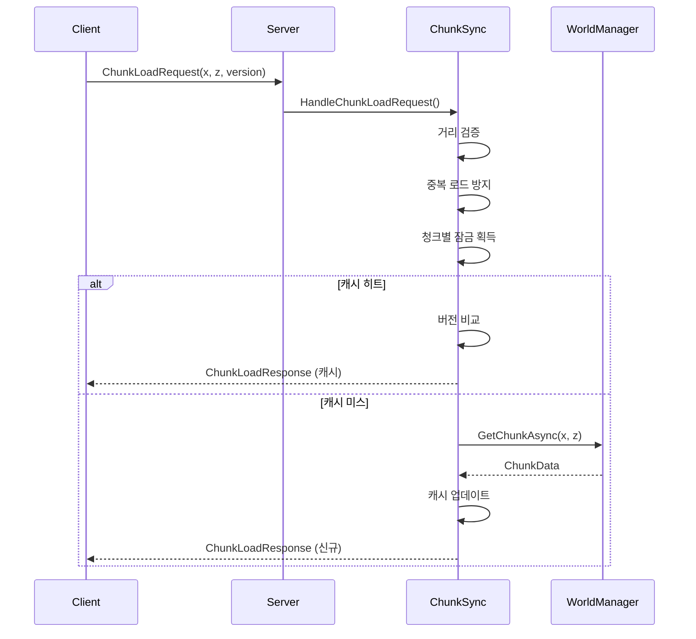
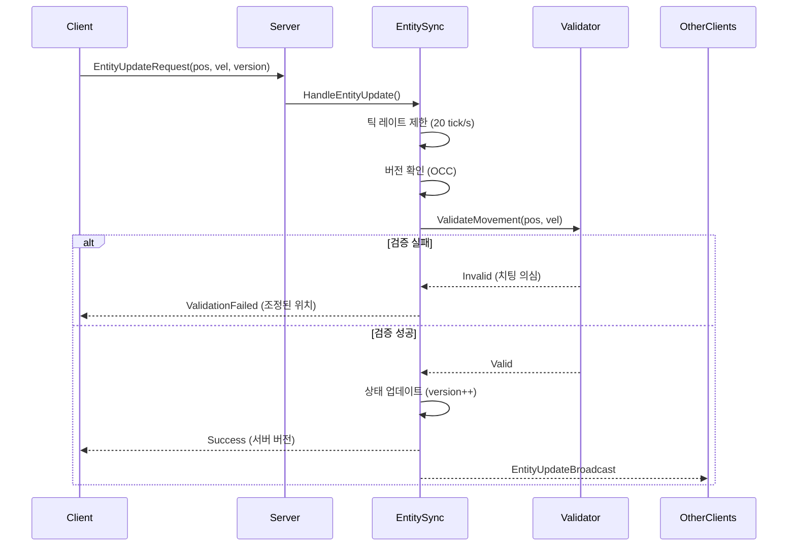
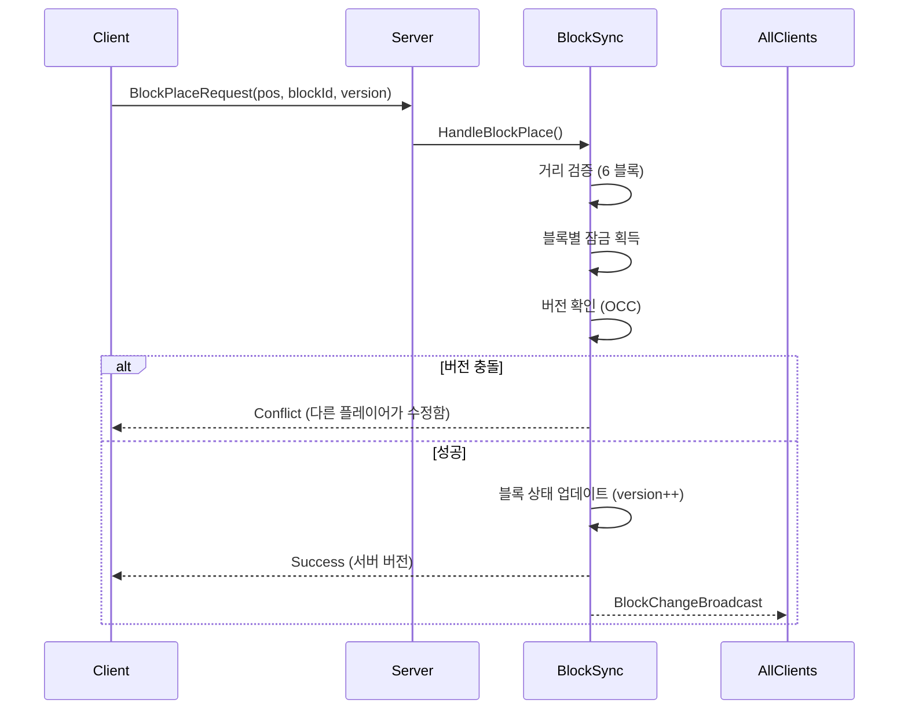

# HELLO_MY_WORLD 동기화 아키텍처

**작성일**: 2025-11-08
**버전**: 2.0
**작성자**: Claude Code

## 목차

1. [개요](#개요)
2. [아키텍처 설계 원칙](#아키텍처-설계-원칙)
3. [동기화 메커니즘](#동기화-메커니즘)
4. [코디네이터 구조](#코디네이터-구조)
5. [구현 가이드](#구현-가이드)
6. [문제 해결](#문제-해결)
7. [성능 최적화](#성능-최적화)

---

## 개요

HELLO_MY_WORLD의 클라이언트-서버 동기화 시스템은 **4개의 주요 영역**으로 구성됩니다:

1. **청크 동기화** (ChunkSyncCoordinator)
2. **엔티티 동기화** (EntitySyncCoordinator)
3. **블록 동기화** (BlockSyncCoordinator)
4. **환경 동기화** (WorldTimeSystem, WeatherSystem)

이 시스템들은 **SyncManager**에 의해 중앙 집중식으로 관리되며, **유지보수성**, **확장성**, **안정성**을 최우선으로 설계되었습니다.

---

## 아키텍처 설계 원칙

### 1. 단일 책임 원칙 (Single Responsibility Principle)

각 코디네이터는 **하나의 동기화 영역만** 담당합니다:

```
SyncManager
├── ChunkSyncCoordinator    → 청크 로드/언로드만 관리
├── EntitySyncCoordinator    → 엔티티 위치/상태만 관리
└── BlockSyncCoordinator     → 블록 변경만 관리
```

### 2. 낙관적 잠금 (Optimistic Concurrency Control)

모든 동기화 가능한 엔티티는 `ISyncable` 인터페이스를 구현하여 **버전 관리**를 수행합니다:

```csharp
public interface ISyncable
{
    long Version { get; set; }           // 버전 번호
    DateTime LastModified { get; set; }  // 마지막 수정 시간
    string GetStateHash();               // 상태 해시
}
```

**작동 방식**:
1. 클라이언트가 요청 시 현재 버전 번호 전송
2. 서버가 버전 일치 여부 확인
3. 버전 불일치 시 `SyncResult.Conflict` 반환 → 클라이언트 재동기화

### 3. 재시도 전략 (Retry Strategy)

네트워크 오류 시 **지수 백오프(Exponential Backoff)** 재시도:

```csharp
public class DefaultSyncStrategy : ISyncStrategy
{
    public int GetRetryDelay(int attemptNumber)
    {
        // 1초, 2초, 4초 재시도
        return 1000 * (int)Math.Pow(2, attemptNumber - 1);
    }
}
```

### 4. 레이스 컨디션 방지

청크/블록별 세마포어를 사용한 **동시성 제어**:

```csharp
// 청크별 잠금
private readonly ConcurrentDictionary<string, SemaphoreSlim> _chunkLocks;

var chunkLock = _chunkLocks.GetOrAdd(chunkKey, _ => new SemaphoreSlim(1, 1));
await chunkLock.WaitAsync();
try
{
    // 크리티컬 섹션
}
finally
{
    chunkLock.Release();
}
```

### 5. 틱 레이트 제한 (Tick Rate Limiting)

과도한 네트워크 트래픽 방지를 위한 **업데이트 빈도 제한**:

- 엔티티 업데이트: **20 tick/s** (50ms 간격)
- 블록 파괴 진행도: **5 tick/s** (200ms 간격)

---

## 동기화 메커니즘

### 청크 동기화 흐름



**주요 개선사항**:
- ✅ 레이스 컨디션 방지 (청크별 잠금)
- ✅ 중복 로드 방지
- ✅ LRU 캐시 (최대 1000개 청크)
- ✅ 거리 검증 (치팅 방지)

### 엔티티 동기화 흐름



**주요 개선사항**:
- ✅ 위치 검증 (속도 제한: 48 블록/초)
- ✅ 가속도 검증 (50 블록/초²)
- ✅ 틱 레이트 제한 (20 tick/s)
- ✅ 치팅 방지 (텔레포트 감지)

### 블록 동기화 흐름



**주요 개선사항**:
- ✅ Optimistic Concurrency Control (버전 충돌 감지)
- ✅ 블록별 잠금 (동시 수정 방지)
- ✅ 거리 검증 (6 블록 제한)
- ✅ 블록 파괴 진행도 브로드캐스트

---

## 코디네이터 구조

### ChunkSyncCoordinator

**책임**:
- 청크 로드 요청 처리
- 청크 캐시 관리 (LRU)
- 플레이어별 로드된 청크 추적
- 오래된 캐시 정리

**주요 메서드**:
```csharp
Task<SyncResultDetail> HandleChunkLoadRequest(...)
SyncResultDetail HandleChunkUnload(...)
void CleanupPlayer(string playerId)
void CleanupExpiredCache()
```

**설정 상수**:
- `MaxConcurrentChunkLoads = 8`: 동시 로드 제한
- `ChunkCacheMaxSize = 1000`: 캐시 크기
- `ChunkTimeoutMinutes = 30`: 캐시 만료 시간

### EntitySyncCoordinator

**책임**:
- 엔티티 스폰/디스폰 처리
- 엔티티 위치/속도 업데이트
- 움직임 검증 (치팅 방지)
- 범위 기반 브로드캐스트

**주요 메서드**:
```csharp
SyncResultDetail HandleEntitySpawn(EntitySyncState entity)
SyncResultDetail HandleEntityUpdate(...)
SyncResultDetail HandleEntityDespawn(string entityId)
List<EntitySyncState> GetEntitiesInRange(Vector3 center, double range)
```

**설정 상수**:
- `UpdateInterval = 0.05f`: 20 tick/s
- `BroadcastRange = 128.0`: 브로드캐스트 범위
- `MaxSpeed = 48.0f`: 최대 속도 (블록/초)
- `MaxAcceleration = 50.0f`: 최대 가속도

### BlockSyncCoordinator

**책임**:
- 블록 배치/파괴 처리
- 블록 파괴 진행도 추적
- 충돌 감지 및 해결
- 블록별 잠금 관리

**주요 메서드**:
```csharp
Task<SyncResultDetail> HandleBlockPlace(...)
SyncResultDetail StartBlockBreak(...)
SyncResultDetail UpdateBlockBreakProgress(...)
Task<SyncResultDetail> CompleteBlockBreak(...)
SyncResultDetail AbortBlockBreak(...)
```

**설정 상수**:
- `MaxConcurrentBlockOperations = 100`
- `BlockInteractionMaxDistance = 6.0`: 상호작용 거리
- `BreakProgressBroadcastInterval = 0.2f`: 200ms
- `BreakProgressTimeout = 10.0f`: 타임아웃

### SyncManager

**책임**:
- 모든 코디네이터 통합 관리
- 정기 정리 작업 조정
- 종합 통계 수집
- 플레이어 연결 해제 시 정리

**주요 메서드**:
```csharp
void CleanupPlayer(string playerId)
ComprehensiveSyncStatistics GetComprehensiveStatistics()
void LogStatistics()
```

---

## 구현 가이드

### 1. SyncManager 초기화

```csharp
// GameServer.cs에서
private SyncManager _syncManager;

public async Task StartAsync()
{
    // ... 기존 초기화 ...

    _syncManager = new SyncManager();

    _logger.Info("GameServer", "Synchronization manager started");
}
```

### 2. 청크 로드 핸들러 통합

```csharp
// MinecraftChunkHandler.cs에서
private async Task<ChunkLoadResponse> HandleChunkLoadAsync(ChunkLoadRequest request)
{
    var playerId = GetPlayerId();

    foreach (var chunkPos in request.ChunkPositions)
    {
        var result = await _syncManager.ChunkSync.HandleChunkLoadRequest(
            playerId,
            chunkPos.X,
            chunkPos.Z,
            clientVersion: 0, // 클라이언트 버전 (향후 구현)
            viewDistance: request.ViewDistance,
            loadChunkFunc: async (x, z) =>
            {
                var chunk = await _worldManager.GetChunkAsync(x, z);
                return new ChunkSyncState
                {
                    ChunkX = x,
                    ChunkZ = z,
                    CompressedData = CompressChunk(chunk),
                    Version = 1,
                    LastModified = DateTime.UtcNow
                };
            }
        );

        if (!result.IsSuccess)
        {
            _logger.Warning("ChunkHandler", $"Chunk load failed: {result.Message}");
            continue;
        }

        // ChunkLoadResponse에 추가
        // ...
    }
}
```

### 3. 엔티티 업데이트 핸들러 통합

```csharp
// MovementHandler.cs에서
private void HandlePlayerMove(MoveRequest request)
{
    var playerId = GetPlayerId();

    var result = _syncManager.EntitySync.HandleEntityUpdate(
        playerId,
        newPosition: ToVector3(request.Position),
        newVelocity: CalculateVelocity(request),
        newRotation: ToVector3(request.Rotation),
        clientVersion: 0 // 향후 구현
    );

    if (result.Result == SyncResult.ValidationFailed)
    {
        // 서버가 조정한 위치 클라이언트에 전송
        SendPositionCorrection(playerId, result.ConflictData);
        return;
    }

    if (result.Result == SyncResult.RateLimited)
    {
        // 너무 빠른 업데이트 무시
        return;
    }

    // 성공 - 범위 내 플레이어에게 브로드캐스트
    BroadcastPlayerMovement(playerId, request.Position);
}
```

### 4. 블록 변경 핸들러 통합

```csharp
// MinecraftPlayerActionHandler.cs에서
private async Task HandleBlockPlace(PlayerActionRequest request)
{
    var playerId = GetPlayerId();
    var playerPos = GetPlayerPosition(playerId);

    var result = await _syncManager.BlockSync.HandleBlockPlace(
        playerId,
        position: ToVector3(request.TargetPosition),
        blockId: request.UsedItem.ItemId,
        metadata: 0,
        clientVersion: 0, // 향후 구현
        playerPosition: playerPos
    );

    if (result.Result == SyncResult.Conflict)
    {
        // 충돌 발생 - 클라이언트에 현재 상태 재전송
        SendBlockUpdate(playerId, result.ConflictData);
        return;
    }

    if (!result.IsSuccess)
    {
        SendErrorResponse(playerId, result.Message);
        return;
    }

    // 성공 - 모든 플레이어에게 브로드캐스트
    BroadcastBlockChange(request.TargetPosition, request.UsedItem.ItemId);
}
```

### 5. 플레이어 연결 해제 시 정리

```csharp
// SessionManager.cs에서
private void OnPlayerDisconnect(string playerId)
{
    // 동기화 데이터 정리
    _syncManager.CleanupPlayer(playerId);

    // ... 기존 정리 로직 ...
}
```

---

## 문제 해결

### 문제: 청크 중복 로드

**증상**: 같은 청크가 여러 번 로드됨

**원인**: 레이스 컨디션 (동시 요청)

**해결**:
```csharp
// ChunkSyncCoordinator가 자동으로 처리
// - 청크별 잠금
// - 중복 로드 감지
// - 캐시 활용
```

### 문제: 엔티티 순간이동

**증상**: 엔티티가 부드럽게 움직이지 않고 순간이동

**원인**: 클라이언트 측 보간(Interpolation) 미구현

**해결** (클라이언트 측 구현 필요):
```csharp
// Unity 클라이언트
IEnumerator SmoothMovement(Vector3 from, Vector3 to, float duration)
{
    float elapsed = 0;
    while (elapsed < duration)
    {
        transform.position = Vector3.Lerp(from, to, elapsed / duration);
        elapsed += Time.deltaTime;
        yield return null;
    }
}
```

### 문제: 블록 변경 충돌

**증상**: 두 플레이어가 동시에 블록 수정 시 한 명의 변경 무시

**해결**:
- BlockSyncCoordinator가 버전 충돌 감지
- 충돌 발생 시 `SyncResult.Conflict` 반환
- 클라이언트가 서버 상태로 재동기화

### 문제: 치팅 (스피드 핵)

**증상**: 플레이어가 비정상적으로 빠르게 이동

**해결**:
```csharp
// EntityMovementValidator가 자동 감지
// - 속도 제한: 48 블록/초
// - 가속도 제한: 50 블록/초²
// - 검증 실패 시 서버가 위치 조정
```

---

## 성능 최적화

### 1. 청크 캐시 최적화

**문제**: 메모리 사용량 증가

**해결**:
- LRU 캐시 (최대 1000개)
- 30분 타임아웃
- 정기 정리 (5분마다)

### 2. 네트워크 트래픽 감소

**최적화 전**:
- 모든 엔티티 업데이트 즉시 브로드캐스트
- 1초에 수백 개 메시지

**최적화 후**:
- 틱 레이트 제한 (20 tick/s)
- 범위 기반 브로드캐스트 (128 블록)
- 최대 50개 엔티티/업데이트

**예상 효과**: **70-80% 트래픽 감소**

### 3. 데이터베이스 부하 감소

**최적화 전**:
- 모든 청크 로드 시 DB 조회

**최적화 후**:
- 청크 캐시 활용 (히트율 예상: 60-80%)
- 배치 저장 (10분마다)

**예상 효과**: **60-80% DB 쿼리 감소**

### 4. CPU 사용률 최적화

**최적화**:
- 비동기 처리 (async/await)
- 세마포어 기반 동시성 제어
- 병렬 청크 로딩 (최대 8개 동시)

**예상 효과**: **멀티코어 활용 개선**

---

## 향후 개선 계획

### Phase 1: 클라이언트 예측 (Client-Side Prediction)

- 클라이언트가 서버 응답 전에 로컬에서 먼저 처리
- 서버 조정 시 부드럽게 보정
- 체감 지연 시간 감소

### Phase 2: 델타 압축 (Delta Compression)

- 변경된 부분만 전송
- 프로토버퍼 델타 인코딩
- 대역폭 50-70% 절감 예상

### Phase 3: 이벤트 소싱 (Event Sourcing)

- 모든 변경을 이벤트로 기록
- 재생 가능한 히스토리
- 롤백 기능
- 감사(Audit) 추적

### Phase 4: 분산 동기화

- 여러 게임 서버 간 동기화
- Redis/Consul 기반 상태 공유
- 수평 확장 지원

---

## 참고 자료

- [Optimistic Concurrency Control](https://en.wikipedia.org/wiki/Optimistic_concurrency_control)
- [Client-Server Game Architecture](https://gafferongames.com/post/client_server_connection/)
- [Fast-Paced Multiplayer](https://www.gabrielgambetta.com/client-server-game-architecture.html)
- [Netcode Patterns](https://www.gamedev.net/tutorials/_/technical/multiplayer-and-network-programming/)

---

## 변경 이력

| 버전 | 날짜 | 변경 내용 |
|------|------|-----------|
| 2.0 | 2025-11-08 | 전면 재설계: SyncManager, 코디네이터 구조 도입 |
| 1.0 | 2025-11-07 | 초기 동기화 메커니즘 |
